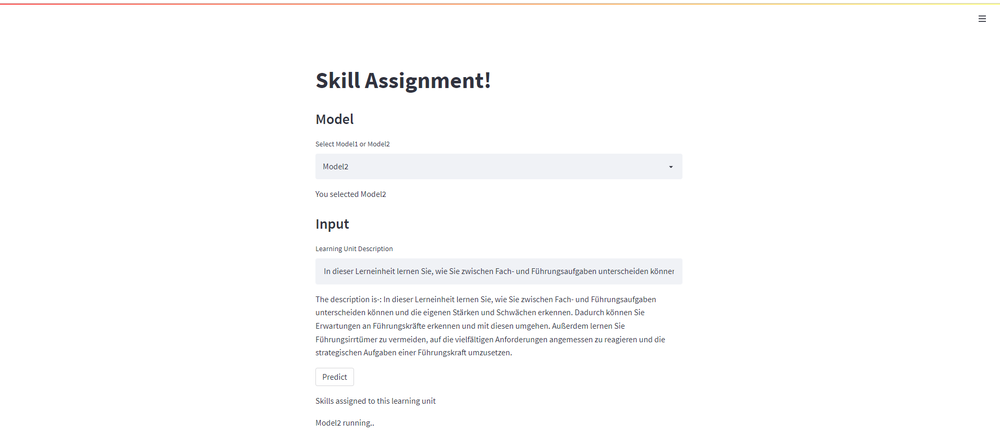

# Data Science Internship Assignment

**Assignment for candidates**

## Table of Contents

1. [Data](#data)
2. [Task - Assigning skills to learning units](#task)
3. [Working with files](#working-with-files)
4. [Modelling](#modelling-rocket)

----

## Data

* **Time series.** I have choosen this dataset [provided file](data/raw/Learning Catalogue.csv) and [provided file](data/raw/Sample_Skills.xlsx) as a process fluctuating in time

---

## Task

* **Assigning Skills to learning unit.** - Building a word level model for predicting which skill should be assigned to the learning unit?

---

## Working with files

* **[LearningUnitAssignmeny](LearningUnitSkillAssignment.ipynb)** - *It contains all analysis, with whole 2 models*

At the end of this file, you can input the new text description and see the skills assignment.

For ease you can also directly use colab notebook for checking the results and approach - [link](https://colab.research.google.com/drive/1_SUG1TjA_WS9h6QX78qmml6e8cPC7_-V?usp=sharing)

* **[app.py](data_processing.py)** - *It contains the simple app build using streamlit for using the build model*

Some glimpse of app -:

* **[predict.py](univariate_model.py)** - *It is predicting the new test input - you have to call one function.*

* **[requirements.txt](requirements.txt)** - *It contains all the requirements for running this project*

### **How to execute the files/code**

    - One is directly go through/run the python notebook- LearningUnitSkillAssignment.ipynb.

    - Else run app.py use the model as per your choice.

-----

## Modelling :rocket:

- Create embeddings using universal sentence encoder embeddings [link](https://tfhub.dev/google/universal-sentence-encoder-multilingual/3), it is a multillingual model.
- Word based model - so created embeddings for each word in description and also skills.
- Find similarity between each word of description and the skill.
- Assign those top skills to that description which are crossing that particular threshold and highest count skill is assigned accordingly.

-----

## Further development

I have trained two models one with removing simple german stop words and second by removing german stop words including words which are occuring more times in our dataset.

If more time will be there these things could be done -:

    - Different embeddings should be tried and thier metrics scores
    - Due to non-labelled dataset , cant appl any supervised learning, but if we have more data then we can apply self learning and then can use supervised learning.

------

